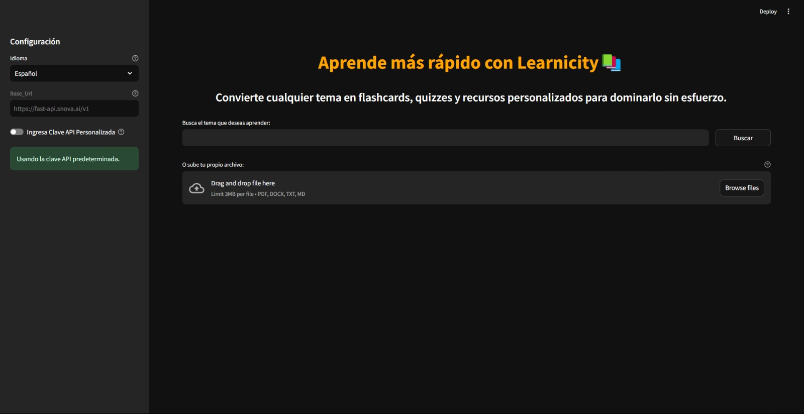

# Learnicity

A multimodal AI learning assistant powered by LLAMA models and intelligent web content analysis.

[](https://learnicity.streamlit.app/)

## Overview

Learnicity is an advanced learning platform that combines multimodal AI with web search to create an interactive learning experience:

- **Content Extraction**: Automatically extracts and analyzes content from web searches
- **Smart Learning Flow**:
  1. Content Analysis & Summarization
  2. Interactive Flashcard Generation
  3. Knowledge Assessment through Quizzes
- **Multimodal Understanding**: Processes both text and visual content for comprehensive learning

## Core Features

- **Intelligent Web Analysis**:
  - Smart web content extraction and analysis
  - Markdown, pdf, text, and docx file support
  - Multimodal content processing (text + visual)

- **Learning Tools**:
  - Auto-generated flashcards from web content
  - Interactive study sessions
  - Progress tracking
  - Knowledge assessment quizzes

- **AI-Powered Features**:
  - Content summarization
  - Key concept extraction
  - Dynamic quiz generation
  - Learning progress analysis

## Tech Stack

- Python 3.11+
- Poetry for dependency management
- Streamlit for UI
- LLAMA 3.2 and 3.1 Models
- SQLite for user data

## Getting Started

### Installation

- **Try it Online**
  - No need to install
  - [](https://learnicity.streamlit.app/)

- **Or Try it Locally**

1. Clone the repository and navigate to the project directory:
```bash
git clone https://github.com/blazzbyte/learnicity
cd learnicity
```

2. Install dependencies with Poetry:
```bash
poetry install
```

3. Set up environment variables:
```bash
# Create .env file with necessary API keys
cp .env.example .env
```

### Running the Application

1. Activate Poetry shell:
```bash
poetry shell
```

2. Run the Streamlit app:
```bash
streamlit run app.py
```

## Learning Flow

1. **Content Discovery**
   - Enter your learning topic
   - AI-powered web search extracts relevant content
   - Multimodal analysis of text and visual content

2. **Study Phase**
   - Review AI-generated summaries
   - Practice with interactive flashcards
   - Track your understanding

3. **Assessment**
   - Take dynamically generated quizzes
   - Get instant feedback
   - Identify areas for review

## Contributing

Contributions to Learnicity are welcome! If you'd like to contribute to this project, please follow these steps:

1. Fork the repository.
2. Create a new branch for your feature or bug fix.
3. Make your changes and commit them with a clear commit message.
4. Push your changes to your fork.
5. Create a pull request to merge your changes into the main repository.

## Support Us

If you find this project helpful and would like to support future projects, consider buying us a coffee! Your support helps us continue building innovative AI solutions.

<a href="https://www.buymeacoffee.com/blazzmocompany"></a>

Your contributions go a long way in fueling our passion for creating intelligent and user-friendly applications.

## License

Learnicity is licensed under the MIT License - see the [LICENSE](LICENSE) file for details.

Feel free to contribute, report issues, or suggest improvements to make Learnicity even better!